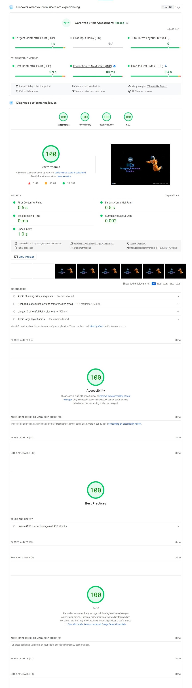
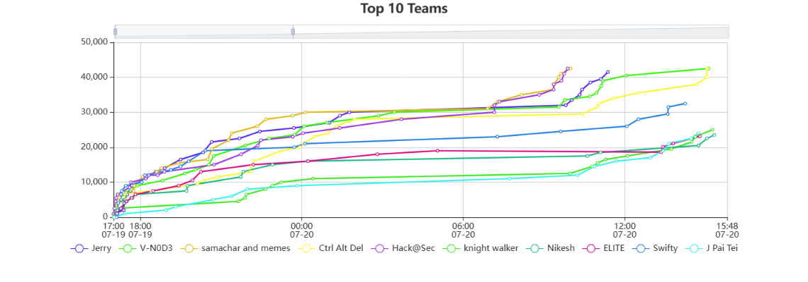

<!-- PROJECT LOGO -->
 

  

  <h3 align="center">HEx Himalaya</h3>

  

    Built with ❤️ & ☕ by IT Club
     
    Himalaya College of Engineering
     

## Apps

| Apps   | Description                                |
| ------ | ------------------------------------------ |
| ctf    | Contains writeups, deployments for HEx CTF |
| genius | Website for HEx Genius Hackathon           |
| web    | Homepage for the HEx Himalaya and events   |

## Built With

## About The Project

### HEx Himalaya (hexhimalaya.com)

HEx Himalaya is the official website for Himalaya Exibition by Himalaya College of Engineering. It is a static website built with Astro keeping performance in mind. It is hosted on Vercel.

This is the website where all the events are listed and the registration instruction are available.

### HEx Genius (genius.hexhimalaya.com)

HEx Genius is the official website for HEx Genius Hackathon by Himalaya College of Engineering. It is a static website built with Nextjs and Tailwind. It is hosted on Vercel.

This website inform hackathon participants about the time remaining, rules of the hackathon and judging criteria.

### HEx CTF (ctf.hexhimalaya.com)

HEx CTF is the official website for HEx CTF by Himalaya College of Engineering. It was a hosted on Azure using the CTFd platform.

Our team deployed the CTFd platform on Azure and customized it to our needs, and we're able to serve more than 7000 requests to our server, over the timespan of 36 hours without any downtime.

## Contributing

Contributions are what make the open source community such an amazing place to learn, inspire, and create. Any contributions you make are **greatly appreciated**.

If you have a suggestion that would make this better, please fork the repo and create a pull request. You can also simply open an issue with the tag "enhancement".
Don't forget to give the project a star! Thanks again!

1. Fork the Project
2. Create your Feature Branch (`git checkout -b feature/AmazingFeature`)
3. Commit your Changes (`git commit -m 'Add some AmazingFeature'`)
4. Push to the Branch (`git push origin feature/AmazingFeature`)
5. Open a Pull Request

## Built by

<!-- LICENSE -->

## License

Distributed under the MIT License. See `LICENSE.txt` for more information.
