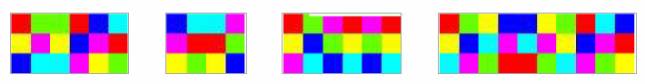

# Hurricane High

The enemy has launched an artificial hurricane in the path of your allies, with the help of a computer network named AE23444, kept hidden in a safe location at Beaufort. You have to measure the wind speed to analyze where the computer is. Decode the hidden message with the help of HEX to win the war. The message is:



Note: Enter the flag as CTF{\<answer>} with spaces replaced by '_'

| Summary              |              |
| -------------------- | ------------ |
| **Category**         | Cryptography |
| **Points**           | 2000         |
| **Links**            |              |
| **Files**            |              |
| **Difficulty (1-5)** | 3            |
| **Tags**             |              |

<details>
  <summary>Hint 1</summary>

The war was held in Beaufort.

</details>

<details>
<summary>Solution</summary>
  
### Follow the process below.
    
Decipher the text using Hexahue decoder.

https://www.dcode.fr/hexahue-cipher

The tricky part here is to find the type of encryption used, use dcode.fr cipher detector to find the type of encryption used. Its in the question that Beaufort encryption is being used.

Decode is using the Beaufort Cipher with "HEX" as the key, and the answer is displayed in the "plaintext" box.

<details>
<summary>Disclose answer ?</summary>

```
CTF{eye_of_the_storm}
```
</details>

</details>
