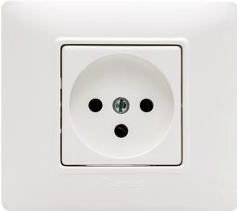

# Mystery Socket

Hexagon has decided where to attack the next. He only attacks centre of administration of a country. We have intercepted his travel logs from one of our spy. Going through his travel logs, we came across a picture of a socket. Help our team to identify, where is he going to attack ?



Note: Enter the flag as CTF{\<answer>} with spaces replaced by '_'

| Summary              |       |
| -------------------- | ----- |
| **Category**         | OSINT |
| **Points**           | 1500  |
| **Links**            |       |
| **Files**            |       |
| **Difficulty (1-5)** | 2     |
| **Tags**             |       |

<details>
  <summary>Hint 1</summary>

Image search might help.

</details>

<details>
<summary>Solution</summary>
  
### Follow the process below.
    
Reverse image search on google gives us the socket as Type-H socket.

Type-H Socket is used only in Israel, so the center of adminstration or capital city is Jerusalem.

<details>
<summary>Disclose answer ?</summary>

```copy
CTF{JERUSALEM}
```

</details>

</details>
